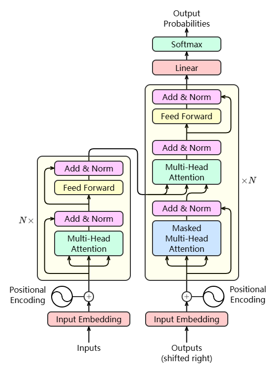
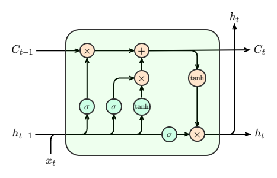
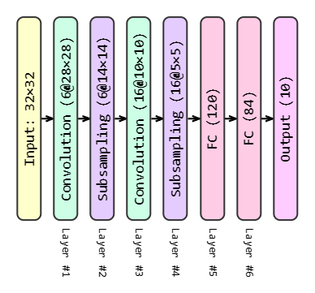
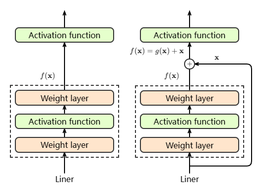
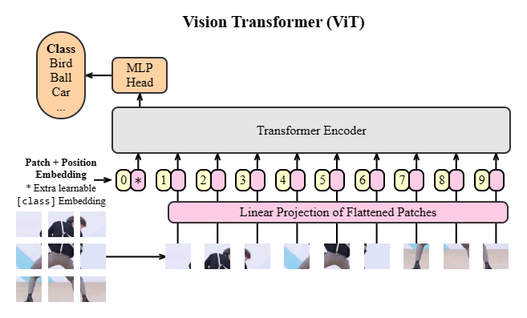

> Note:
> All the colors used in the examples are randomly generated.

+ Transformer

  [Live Demo](https://howardzhangdqs.github.io/ml-graph-generator/#/transformer)
  
  size: 12.97 KiB

  

+ LSTM

  [Live Demo](https://howardzhangdqs.github.io/ml-graph-generator/#/lstm)
  
  size: 8.18 KiB

  

+ LeNet

  [Live Demo](https://howardzhangdqs.github.io/ml-graph-generator/#/lenet)
  
  size: 3.45 KiB

  

+ ResNet

  [Live Demo](https://howardzhangdqs.github.io/ml-graph-generator/#/resnet)
  
  size: 5.86 KiB

  

+ ViT

  [Live Demo](https://howardzhangdqs.github.io/ml-graph-generator/#/vit)

  